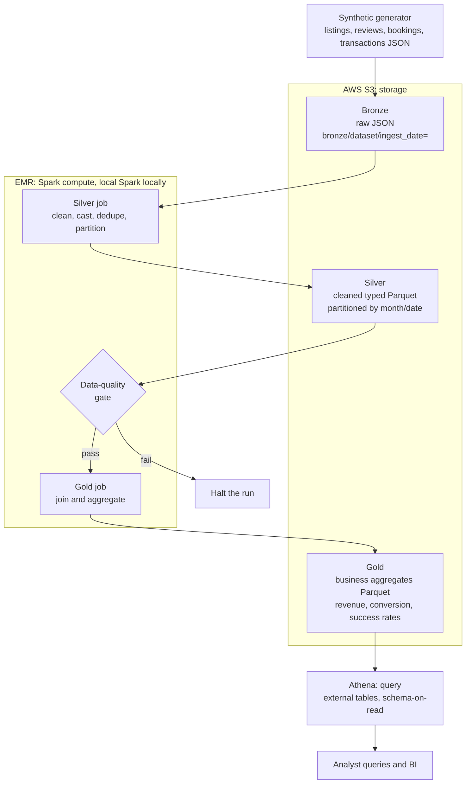

# Cloud Data Lake and Query Optimization

A production-shaped medallion data lake on AWS with a measured query
optimization benchmark at its core. It combines four AWS services: S3 for
storage, EMR (Spark on EMR) as the processing and compute layer that runs the
bronze, silver, and gold jobs, Athena for querying the gold layer, and
partitioned Parquet as the physical format throughout. It is built with PySpark
and boto3. The entire pipeline runs offline on a laptop, where moto stands in
for S3 and local Spark stands in for EMR, and the path to a real AWS deployment
is documented in the runbook.

The lake models an Airbnb-style marketplace across four datasets: listings,
reviews, bookings, and transactions. On top of that, a self-contained benchmark
builds an unoptimized and an optimized copy of a large transaction dataset,
runs a fixed set of analytical queries against both, and reports the real
measured runtime reduction from partitioning, column pruning, file compaction,
predicate pushdown, and SQL query rewrites.

## Query optimization results

The headline number below is measured, not assumed. It comes from running
`benchmark/run_benchmark.py`, which times each query multiple times and takes
the median wall-clock after a warm-up run. See "Run the benchmark" for how to
reproduce it.

- Dataset: 20,000,000 synthetic transaction rows spanning 730 days
- Queries: 5 representative analytical queries
- Timing: median of 3 timed runs per query after one warm-up
- Baseline layout: a single large unpartitioned CSV, all columns, no columnar
  statistics
- Optimized layout: month-partitioned, compacted, column-pruned, sorted Parquet
  with row-group statistics

**Overall runtime reduction: 94.54% across all five queries (18.31x overall
speedup), 23.38s down to 1.28s of total median query time.** The optimized
layout is also 18.6x smaller on disk (4.9 GB of CSV down to 265 MB of Parquet).

| Query                      | Technique demonstrated                               | Baseline (s) | Optimized (s) | Speedup | Reduction |
| -------------------------- | ---------------------------------------------------- | -----------: | ------------: | ------: | --------: |
| q1_date_range_agg          | Date-range aggregation (partition pruning + stats)   |         5.13 |          0.10 |  50.12x |     98.0% |
| q2_status_filter_group     | Status filter + group by (column pruning + pushdown) |         4.05 |          0.29 |  14.03x |    92.87% |
| q3_single_day_lookup       | Single-day point lookup (partition pruning)          |         4.48 |          0.06 |  70.59x |    98.58% |
| q4_join_filter_before_join | Join with filter-before-join rewrite                 |         5.33 |          0.53 |  10.02x |    90.02% |
| q5_wide_scan_agg           | Wide-table scan aggregation (column pruning)         |         4.40 |          0.29 |  15.14x |     93.4% |

The gains are driven by, in order of impact:

- Partitioning: date-bounded queries prune whole month directories instead of
  scanning the full dataset.
- Column pruning: reading only the columns a query needs, rather than every
  column of a wide row, so queries touch a fraction of the bytes.
- Parquet plus predicate pushdown: the optimized side is columnar Parquet with
  per-file min/max statistics, and rows are sorted within each partition so the
  reader skips row groups that cannot match a filter. The baseline CSV has no
  statistics and must be fully parsed.
- File compaction: the optimized data is written as one right-sized file per
  partition, avoiding the small-file tax the naive layout pays.
- SQL query rewrites: the join query filters and projects both sides down
  before the join instead of joining wide tables and filtering afterward, and
  never uses SELECT star.

The full per-query numbers and the exact configuration are written to
`benchmark/results.json` and `benchmark/RESULTS.md` on every run.

## The AWS stack: S3, EMR, Athena, Spark, and Parquet

| Concern                | AWS service                                                | Local stand-in                                   |
| ---------------------- | ---------------------------------------------------------- | ------------------------------------------------ |
| Storage                | S3, one bucket with bronze, silver, and gold prefixes      | moto in-process mock S3                          |
| Compute and processing | EMR running the PySpark bronze, silver, and gold jobs      | local Spark (`local[*]`)                         |
| File format            | partitioned Parquet with column statistics for silver/gold | identical Parquet on local disk                  |
| Query and analytics    | Athena over the gold Parquet, schema-on-read               | the same Athena DDL, run once data is in real S3 |

The PySpark code that performs the medallion transformations is identical in
both environments. Locally it runs on a local Spark session standing in for
EMR; on AWS the same jobs are submitted to an EMR cluster. Only the configured
paths change: `data/lake` on disk locally, `s3://<bucket>/...` on AWS.

## Architecture

The compute that moves data between layers runs on EMR (local Spark stands in
for EMR when running offline). The layers live in S3 as partitioned Parquet,
and Athena queries the gold layer in place.



## The four datasets

- Listings: the property dimension (id, name, host, neighbourhood, room type,
  price, minimum nights).
- Reviews: guest reviews joined to listings (rating, date, comments).
- Bookings: reserved stays (booking_id, listing_id, guest_id, checkin_date,
  checkout_date, nights, amount, status).
- Transactions: payment events against bookings (txn_id, booking_id, ts,
  amount, currency, payment_method, status).

The generator seeds defects and duplicates into every dataset so the silver
cleaning and data-quality steps have real problems to catch. Bookings reference
real listings and transactions reference real bookings, so the four tables join
cleanly.

## Medallion layers

- Bronze: raw records for all four datasets landed as-is into
  `s3://<bucket>/bronze/<dataset>/ingest_date=<date>/`, one JSON object per
  batch. Immutable and faithful to the source. Landed and read back through the
  real S3 API (mocked by moto locally) to prove the object and partition
  conventions.
- Silver: a PySpark job reads bronze with an explicit schema (schema-on-read),
  casts types, drops invalid records, deduplicates on the natural key, and
  writes Parquet. Reviews are partitioned by review month, bookings by check-in
  month, and transactions by transaction date; listings form an unpartitioned
  dimension. Writes are idempotent through dynamic partition overwrite.
- Gold: a PySpark job joins the fact tables to listings and builds curated
  Parquet tables. For listings and reviews: reviews per listing, average rating
  per listing, reviews per neighbourhood. For the revenue side: revenue by
  listing and month (partitioned by check-in month), booking conversion and
  cancellation rates per listing, and transaction success rates per payment
  method.

A data-quality gate runs between silver and gold. It asserts the reviews table
is non-empty, review ids are unique after dedupe, no null keys survived, and
every rating falls within one to five. Any failure raises an error and halts
the run rather than letting bad data reach the business tables.

## Tech stack

- Amazon S3 for lake storage, with bronze, silver, and gold prefixes
- Amazon EMR as the Spark compute layer that runs the bronze, silver, and gold
  jobs; locally this is a local Spark session standing in for EMR
- PySpark 3.5.4 for the bronze, silver, and gold transformations and the
  benchmark
- Partitioned Parquet with column statistics for the silver and gold layers
- boto3 for the S3 bronze landing zone
- moto for an in-process mock S3, so the pipeline runs with no AWS account
- pyarrow for Parquet
- Amazon Athena and AWS Glue for schema-on-read querying of the gold layer
- pytest for the test suite

## Run locally with mock S3

Requires Python 3.11 and a Java 17 or later runtime for Spark.

```sh
python -m venv .venv
source .venv/bin/activate
pip install -r requirements.txt

export JAVA_HOME=$(/usr/libexec/java_home)   # macOS; set to your JDK elsewhere
python -m src.run_pipeline
```

The single entry point spins up mock S3, generates all four datasets, runs
bronze, silver, the quality gate, and gold, then prints row counts per layer
and a sample of gold output including revenue, conversion, and payment success.
Tune the volume with `--num-listings`, `--ingest-date`, and `--seed`.

Run the tests:

```sh
pytest -q
```

## Run the benchmark

The benchmark builds its datasets offline under `benchmark/_data` (gitignored)
and reuses them across runs unless `--rebuild` is passed.

```sh
export JAVA_HOME=$(/usr/libexec/java_home)
python -m benchmark.run_benchmark --rows 20000000 --runs 3
```

It builds a baseline unoptimized CSV and an optimized Parquet layout of the same
data, times each query on both, and writes `benchmark/results.json` and
`benchmark/RESULTS.md`. Both sides use the same Spark session and configuration,
so the only variable is the physical data layout. Increase `--rows` and `--runs`
for a larger, steadier measurement.

## Deploy to real AWS

See `docs/deploy-aws.md` and `docs/DEPLOY-RUNBOOK.md` for the full walkthrough:
IAM setup, pointing the pipeline at a real bucket, submitting the Spark jobs to
EMR Serverless, and querying the gold layer with Athena. The external table
definitions for all silver and gold tables live in `sql/athena_ddl.sql`.

## Project layout

```
src/
  config.py         path and bucket conventions, four dataset names
  storage.py        boto3 S3 helpers (real and mocked)
  bronze.py         raw landing zone
  silver.py         clean, cast, dedupe, partitioned Parquet for all four datasets
  gold.py           joined business aggregates incl. revenue and payment metrics
  quality.py        data-quality gate
  spark_session.py  local Spark factory
  run_pipeline.py   end-to-end entry point
scripts/
  generate_events.py  synthetic generator for all four datasets
benchmark/
  run_benchmark.py    baseline vs optimized query-optimization benchmark
  results.json        measured results (written on each run)
  RESULTS.md          measured results as a markdown table
sql/
  athena_ddl.sql    external table definitions and sample queries
docs/
  deploy-aws.md     real-AWS deployment guide
  DEPLOY-RUNBOOK.md operational runbook
tests/              pytest suite
```

All glory to God! ✝️❤️
