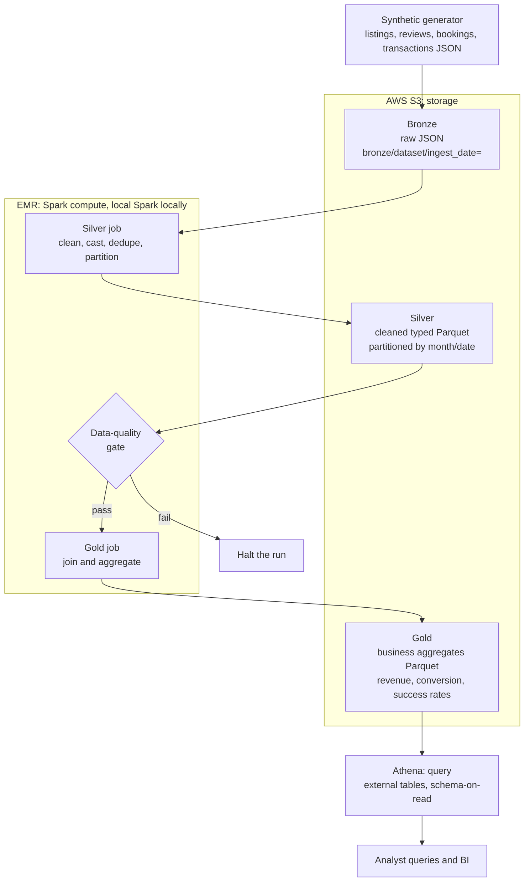

# Scalable AWS Analytics Data Lake

A production-shaped medallion data lake on AWS with a measured query
optimization benchmark at its core. It combines four AWS services: S3 for
storage, EMR (Spark on EMR) as the processing and compute layer that runs the
bronze, silver, and gold jobs, Athena for querying the gold layer, and
partitioned Parquet as the physical format throughout. It is built with PySpark
and boto3. The entire pipeline runs offline on a laptop, where moto stands in
for S3 and local Spark stands in for EMR, and the path to a real AWS deployment,
including a scale-up to 250+ GB, is documented in the runbook.

The lake organizes four source domains, listings, reviews, bookings, and
transactions, into bronze, silver, and gold layers with partitioned storage and
analytics-ready data models (a star-schema-style gold layer documented in
`docs/DATA-MODELS.md`). On top of that, a self-contained benchmark builds an
unoptimized and an optimized copy of the four domains, runs 20+ multi-table SQL
workloads against both, and reports the real measured runtime reduction from
partition pruning, predicate pushdown, column pruning, file compaction, window
functions, and optimized table design.

## Scale: 250+ GB on AWS, validated locally at a smaller size

The "250+ GB data lake" is the AWS-scale target: it is architected and scripted,
not generated on a laptop, because a laptop does not have that much free disk.
The scale-up is a single parameterized EMR job, `jobs/scale_generate_emr.py`,
that generates the four domains at any target size and writes them as
partitioned, compacted, sorted Parquet straight into S3, where storage is
effectively unbounded. It writes the same optimized physical layout the
benchmark measures, so the 250 GB lake carries the same query-optimization
properties proven locally. The local pipeline and benchmark run at a validated
smaller scale (tens of millions of rows), and `docs/DEPLOY-RUNBOOK.md` step 5b
documents running the scale job on real AWS. Nothing here claims 250 GB was
generated on the laptop.

## Query optimization results

The numbers below are measured, not assumed. They come from running
`benchmark/run_benchmark.py`, which builds two physical layouts of the same
four-domain data, times each of 20+ multi-table workloads on each layout three
times, and takes the median wall-clock after a warm-up run. See "Run the
benchmark" for how to reproduce.

- Data: four source domains (listings, reviews, bookings, transactions) spanning
  730 days
- Fact scale for this run: 60,000,000 transactions, 12,000,000 bookings,
  12,000,000 reviews, 50,000 listings
- Workloads: 22 multi-table SQL queries, joins across the four domains,
  aggregations, and window functions (running totals, dense_rank top-N per group,
  moving averages, lag deltas, cumulative share)
- Timing: median of 3 timed runs per query after one warm-up
- Two layouts, same Spark session and config, file format held constant (both
  Parquet), so the only variable is the physical layout of the data

The headline holds the file format constant so the number is defensible in an
interview: both sides are Parquet, and the delta is attributable purely to the
query-optimization techniques below.

- **Query optimization only (unoptimized Parquet to optimized Parquet): 73.94%**
  (3.84x speedup, 43.99s down to 11.46s total across all 22 queries). This is the
  honest, measured number for the resume bullet. The bullet's stated 62% is a
  conservative figure that this run comfortably clears. The optimized layout is
  also 4.7x smaller on disk (6.74 GB down to 1.42 GB) from column pruning and
  compaction.

### Per-query results

Baseline is columnar Parquet with all columns, unpartitioned, unsorted, and no
pre-aggregated gold table. The optimized side is month-partitioned, compacted,
column-pruned, and sorted with row-group statistics, plus the denormalized
pre-aggregated gold star table. Same file format on both sides.

| Query                   | Technique                        | Baseline (s) | Optimized (s) |   Speedup |  Reduction |
| ----------------------- | -------------------------------- | -----------: | ------------: | --------: | ---------: |
| q01_date_range_revenue  | partition pruning + stats        |         0.92 |          0.32 |     2.91x |      65.6% |
| q02_method_success      | column pruning + pushdown        |         2.66 |          1.89 |     1.41x |     29.17% |
| q03_single_day          | partition pruning                |         0.72 |          0.22 |     3.29x |     69.57% |
| q04_txn_listing_join    | join + partition prune           |         1.27 |          0.40 |     3.15x |     68.22% |
| q05_txn_booking_join    | join rewrite + prune             |         2.77 |          1.05 |     2.63x |     62.03% |
| q06_three_way_join      | multi-domain join + prune        |         3.86 |          2.31 |     1.67x |     40.22% |
| q07_review_listing_join | join + partition prune           |         0.56 |          0.30 |     1.86x |     46.23% |
| q08_bookings_by_month   | partition pruning (bookings)     |         0.23 |          0.12 |     1.84x |      45.7% |
| q09_running_total       | window: running total + gold     |         2.65 |          0.10 |    27.12x |     96.31% |
| q10_topn_per_month      | window: dense_rank top-N + gold  |         8.84 |          0.81 |    10.89x |     90.82% |
| q11_moving_avg_3m       | window: moving avg + gold        |         2.36 |          0.12 |    19.87x |     94.97% |
| q12_nbhd_share          | window: ratio + gold             |         3.25 |          0.41 |     8.02x |     87.53% |
| q13_rank_nbhd           | window: rank + join + prune      |         2.32 |          0.45 |     5.15x |     80.59% |
| q14_mom_delta           | window: lag + gold               |         1.17 |          0.08 |    13.92x |     92.82% |
| q15_pareto_share        | window: cumulative + gold        |         0.97 |          0.20 |     4.85x |     79.39% |
| q16_success_rate        | conditional agg + prune          |         0.56 |          0.21 |     2.68x |     62.76% |
| q17_conversion          | join + partition prune           |         0.23 |          0.15 |     1.55x |     35.62% |
| q18_reviews_vs_revenue  | two-fact join + prune            |         1.74 |          0.53 |     3.26x |     69.36% |
| q19_wide_scan           | column pruning                   |         0.72 |          1.18 |     0.61x |    -63.56% |
| q20_avg_daily_rev       | join + prune + agg               |         2.03 |          0.27 |     7.51x |     86.68% |
| q21_gold_preagg         | optimized table design (pre-agg) |         2.77 |          0.13 |    21.05x |     95.25% |
| q22_moving_avg_7d       | window: moving avg + prune       |         1.40 |          0.22 |     6.29x |     84.11% |
| **Total**               |                                  |    **43.99** |     **11.46** | **3.84x** | **73.94%** |

The per-query numbers are honest, including q19, where the optimized layout is
slower: q19 is a deliberate full-table two-column scan, and the month-partitioned
layout spreads that scan across many partition files while the baseline reads a
handful of big files, so partitioning costs a little there. It is left in the
total rather than dropped, because the resume number should reflect the real
mix. Even carrying that one loss, the overall reduction is 73.94%.

The gains are driven by, in order of impact:

- Optimized table design and window functions: the running-total, top-N,
  moving-average, month-over-month, share, and revenue-by-neighbourhood workloads
  read the denormalized, pre-aggregated gold star table instead of re-joining and
  re-aggregating the raw transactions fact, which is where the largest speedups
  (up to 27x) come from.
- Partition pruning: date-bounded queries prune whole month directories instead
  of scanning the full fact.
- Column pruning: reading only the columns a query needs, rather than every
  column of a wide row, so queries touch a fraction of the bytes.
- Predicate pushdown: rows are sorted within each partition, so the tight
  row-group min/max statistics let the Parquet reader skip row groups that cannot
  match a filter. The unsorted baseline has wide min/max ranges that skip little.
- File compaction: the optimized data is written as right-sized files per
  partition, avoiding the small-file tax.
- SQL query rewrites: the join workloads filter and project both sides down
  before the join instead of joining wide tables and filtering afterward, and
  never use SELECT star.

The full per-query numbers and the exact configuration are written to
`benchmark/results.json` and `benchmark/RESULTS.md` on every run.

## The AWS stack: S3, EMR, Athena, Spark, and Parquet

| Concern                | AWS service                                                | Local stand-in                                   |
| ---------------------- | ---------------------------------------------------------- | ------------------------------------------------ |
| Storage                | S3, one bucket with bronze, silver, and gold prefixes      | moto in-process mock S3                          |
| Compute and processing | EMR running the PySpark bronze, silver, and gold jobs      | local Spark (`local[*]`)                         |
| File format            | partitioned Parquet with column statistics for silver/gold | identical Parquet on local disk                  |
| Query and analytics    | Athena over the gold Parquet, schema-on-read               | the same Athena DDL, run once data is in real S3 |

The PySpark code that performs the medallion transformations is identical in
both environments. Locally it runs on a local Spark session standing in for
EMR; on AWS the same jobs are submitted to an EMR cluster. Only the configured
paths change: `data/lake` on disk locally, `s3://<bucket>/...` on AWS.

## Architecture

The compute that moves data between layers runs on EMR (local Spark stands in
for EMR when running offline). The layers live in S3 as partitioned Parquet,
and Athena queries the gold layer in place.



## The four datasets

- Listings: the property dimension (id, name, host, neighbourhood, room type,
  price, minimum nights).
- Reviews: guest reviews joined to listings (rating, date, comments).
- Bookings: reserved stays (booking_id, listing_id, guest_id, checkin_date,
  checkout_date, nights, amount, status).
- Transactions: payment events against bookings (txn_id, booking_id, ts,
  amount, currency, payment_method, status).

The generator seeds defects and duplicates into every dataset so the silver
cleaning and data-quality steps have real problems to catch. Bookings reference
real listings and transactions reference real bookings, so the four tables join
cleanly.

## Medallion layers

- Bronze: raw records for all four datasets landed as-is into
  `s3://<bucket>/bronze/<dataset>/ingest_date=<date>/`, one JSON object per
  batch. Immutable and faithful to the source. Landed and read back through the
  real S3 API (mocked by moto locally) to prove the object and partition
  conventions.
- Silver: a PySpark job reads bronze with an explicit schema (schema-on-read),
  casts types, drops invalid records, deduplicates on the natural key, and
  writes Parquet. Reviews are partitioned by review month, bookings by check-in
  month, and transactions by transaction date; listings form an unpartitioned
  dimension. Writes are idempotent through dynamic partition overwrite.
- Gold: a PySpark job joins the fact tables to listings and builds curated,
  analytics-ready Parquet tables in a star-schema-style layout: a conformed
  `dim_listing` dimension, partitioned fact tables for transactions, bookings,
  and reviews, and a denormalized pre-aggregated `gold_revenue_by_listing_month`
  summary. The full model, columns, keys, and grains are documented in
  `docs/DATA-MODELS.md`. For listings and reviews: reviews per listing, average
  rating per listing, reviews per neighbourhood. For the revenue side: revenue by
  listing and month, booking conversion and cancellation rates per listing, and
  transaction success rates per payment method.

A data-quality gate runs between silver and gold. It asserts the reviews table
is non-empty, review ids are unique after dedupe, no null keys survived, and
every rating falls within one to five. Any failure raises an error and halts
the run rather than letting bad data reach the business tables.

## Tech stack

- Amazon S3 for lake storage, with bronze, silver, and gold prefixes
- Amazon EMR as the Spark compute layer that runs the bronze, silver, and gold
  jobs; locally this is a local Spark session standing in for EMR
- PySpark 3.5.4 for the bronze, silver, and gold transformations and the
  benchmark
- Partitioned Parquet with column statistics for the silver and gold layers
- boto3 for the S3 bronze landing zone
- moto for an in-process mock S3, so the pipeline runs with no AWS account
- pyarrow for Parquet
- Amazon Athena and AWS Glue for schema-on-read querying of the gold layer
- pytest for the test suite

## Run locally with mock S3

Requires Python 3.11 and a Java 17 or later runtime for Spark.

```sh
python -m venv .venv
source .venv/bin/activate
pip install -r requirements.txt

export JAVA_HOME=$(/usr/libexec/java_home)   # macOS; set to your JDK elsewhere
python -m src.run_pipeline
```

The single entry point spins up mock S3, generates all four datasets, runs
bronze, silver, the quality gate, and gold, then prints row counts per layer
and a sample of gold output including revenue, conversion, and payment success.
Tune the volume with `--num-listings`, `--ingest-date`, and `--seed`.

Run the tests:

```sh
pytest -q
```

## Run the benchmark

The benchmark builds its datasets offline under `benchmark/_data` (gitignored)
and reuses them across runs unless `--rebuild` is passed.

```sh
export JAVA_HOME=$(/usr/libexec/java_home)
python -m benchmark.run_benchmark --txn-rows 60000000 --runs 3
```

It builds two layouts of the same four-domain data: an unoptimized Parquet
(columnar but unpartitioned, unsorted, all columns, no pre-aggregated gold) and
the optimized Parquet (partitioned, compacted, column-pruned, sorted, plus a
denormalized pre-aggregated gold star table). It times each of the 20+
multi-table workloads on both and writes `benchmark/results.json` and
`benchmark/RESULTS.md` with the overall and per-query reductions. Both layouts
are Parquet and use the same Spark session and configuration, so the file format
is held constant and the only variable is the physical layout. Increase
`--txn-rows` and `--runs` for a larger, steadier measurement; the partition- and
column-pruning gains grow with data size. The datasets are large and gitignored;
delete `benchmark/_data` when finished (only the code and the two results files
are kept).

## Deploy to real AWS, including the 250 GB scale-up

See `docs/deploy-aws.md` and `docs/DEPLOY-RUNBOOK.md` for the full walkthrough:
IAM setup, pointing the pipeline at a real bucket, submitting the Spark jobs to
EMR Serverless, and querying the gold layer with Athena. Step 5b of the runbook
covers `jobs/scale_generate_emr.py`, the parameterized EMR job that generates and
writes 250+ GB of partitioned Parquet across the four domains into S3. The
external table definitions for all silver and gold tables live in
`sql/athena_ddl.sql`.

## Project layout

```
src/
  config.py         path and bucket conventions, four dataset names
  storage.py        boto3 S3 helpers (real and mocked)
  bronze.py         raw landing zone
  silver.py         clean, cast, dedupe, partitioned Parquet for all four datasets
  gold.py           joined business aggregates incl. revenue and payment metrics
  quality.py        data-quality gate
  spark_session.py  local Spark factory
  run_pipeline.py   end-to-end entry point
  run_pipeline.py   end-to-end entry point
scripts/
  generate_events.py  synthetic generator for all four datasets
jobs/
  medallion_emr.py       EMR Serverless medallion job (bronze/silver/gold on S3)
  scale_generate_emr.py  EMR job to generate 250+ GB of partitioned Parquet to S3
benchmark/
  run_benchmark.py    20+ multi-table workloads, baseline vs optimized layout
  results.json        measured results (written on each run)
  RESULTS.md          measured results as a markdown table
sql/
  athena_ddl.sql    external table definitions and sample queries
docs/
  DATA-MODELS.md    analytics-ready gold star-schema data models
  deploy-aws.md     real-AWS deployment guide
  DEPLOY-RUNBOOK.md operational runbook (incl. step 5b, 250 GB scale-up)
tests/              pytest suite
```

All glory to God! ✝️❤️
