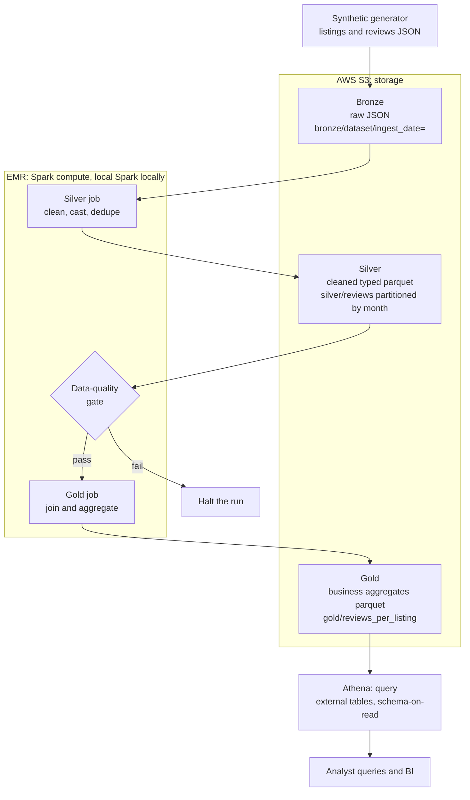

# Airbnb Medallion Data Lake on AWS S3

A production-shaped medallion architecture data lake for Airbnb listings and
reviews that combines three AWS services: S3 for storage, EMR (Spark on EMR)
as the processing and compute layer that runs the bronze, silver, and gold
jobs, and Athena for querying the gold layer. It is built with PySpark and
boto3. The entire pipeline runs offline on a laptop, where moto stands in for
S3 and local Spark stands in for EMR, and the path to a real AWS deployment is
documented. This is the data lake project from the ZTM Data Engineering course,
rebuilt end to end around its Airbnb dataset.

## The AWS trio: S3, EMR, and Athena

| Concern                | AWS service                                           | Local stand-in                                   |
| ---------------------- | ----------------------------------------------------- | ------------------------------------------------ |
| Storage                | S3, one bucket with bronze, silver, and gold prefixes | moto in-process mock S3                          |
| Compute and processing | EMR running the PySpark bronze, silver, and gold jobs | local Spark (`local[*]`)                         |
| Query and analytics    | Athena over the gold parquet, schema-on-read          | the same Athena DDL, run once data is in real S3 |

The PySpark code that performs the medallion transformations is identical in
both environments. Locally it executes on a local Spark session standing in for
EMR; on AWS the same jobs are submitted to an EMR cluster. Only the configured
paths change: `data/lake` on disk locally, `s3://<bucket>/...` on AWS.

## Architecture

The compute that moves data between layers runs on EMR (local Spark stands in
for EMR when running offline). The layers themselves live in S3, and Athena
queries the gold layer in place.



## Layers

- Bronze: raw Airbnb listings and reviews landed as-is into
  `s3://<bucket>/bronze/<dataset>/ingest_date=<date>/`, one JSON object per
  batch. Immutable and faithful to the source. Landed and read back through the
  real S3 API (mocked by moto locally) to prove the object and partition
  conventions.
- Silver: a PySpark job reads bronze with an explicit schema (schema-on-read),
  casts types, drops invalid records, deduplicates on the natural key, and
  writes parquet. Reviews are partitioned by review month; listings form an
  unpartitioned dimension. Writes are idempotent through dynamic partition
  overwrite.
- Gold: a PySpark job joins reviews to listings and builds three curated
  parquet tables: reviews per listing (the course's flagship aggregate),
  average rating per listing, and reviews per neighbourhood.

A data-quality gate runs between silver and gold. It asserts the reviews table
is non-empty, review ids are unique after dedupe, no null keys survived, and
every rating falls within one to five. Any failure raises an error and halts
the run rather than letting bad data reach the business tables.

## Tech stack

- Amazon S3 for lake storage, with bronze, silver, and gold prefixes
- Amazon EMR as the Spark compute layer that runs the bronze, silver, and gold
  jobs; locally this is a local Spark session standing in for EMR
- PySpark 3.5.4 for the bronze, silver, and gold transformations
- boto3 for the S3 bronze landing zone
- moto for an in-process mock S3, so the pipeline runs with no AWS account
- pyarrow for parquet
- Amazon Athena and AWS Glue for schema-on-read querying of the gold layer
- pytest for the test suite

## Design notes

- Partitioning strategy: bronze partitions by ingest date for replayable
  landings, silver partitions reviews by review month to prune scans on
  time-bounded queries, and gold aggregates are small enough to write whole.
- Schema-on-read: silver applies an explicit Spark schema rather than inferring
  it, and Athena reads parquet in place through external tables.
- Idempotent writes: silver and gold write with overwrite plus dynamic
  partition overwrite, so re-running a batch replaces only the affected
  partitions instead of duplicating data.
- Local Spark reads and writes a mirrored lake root on disk because the Hadoop
  s3a client against an in-process moto endpoint is unreliable. The bronze
  landing still exercises real S3 semantics through boto3 and moto, and the
  real-AWS path in `docs/deploy-aws.md` points Spark straight at `s3://` URIs.

## Run locally with mock S3

Requires Python 3.11 and a Java 17 or later runtime for Spark.

```sh
python -m venv .venv
source .venv/bin/activate
pip install -r requirements.txt

export JAVA_HOME=$(/usr/libexec/java_home)   # macOS; set to your JDK elsewhere
python -m src.run_pipeline
```

The single entry point spins up mock S3, generates data, runs bronze, silver,
the quality gate, and gold, then prints row counts per layer and a sample of
gold output. Tune the volume with `--num-listings`, `--ingest-date`, and
`--seed`.

Run the tests:

```sh
pytest -q
```

## Sample gold output

Reviews per listing (top rows):

```
+----+--------------------------------------+-------------+-----------+
|id  |name                                  |neighbourhood|num_reviews|
+----+--------------------------------------+-------------+-----------+
|1130|Spacious Apartment in Mission District|Downtown     |12         |
|1099|Modern Flat in Capitol Hill           |Downtown     |12         |
|1151|Central Suite in Fitzroy              |Kreuzberg    |12         |
+----+--------------------------------------+-------------+-----------+
```

Reviews per neighbourhood:

```
+----------------+-----------+----------+------------+
|neighbourhood   |num_reviews|avg_rating|num_listings|
+----------------+-----------+----------+------------+
|Williamsburg    |308        |2.9       |45          |
|Fitzroy         |298        |2.95      |43          |
|Kreuzberg       |255        |3.03      |40          |
+----------------+-----------+----------+------------+
```

Example run summary:

```
bronze: 300 listings + 2092 reviews landed
silver: 300 listings + 1852 reviews
gold.reviews_per_listing: 299 rows
gold.avg_rating_per_listing: 299 rows
gold.reviews_per_neighbourhood: 8 rows
```

The silver counts are lower than bronze by design: the injected dirty and
duplicate records are dropped during cleaning.

## Deploy to real AWS

See `docs/deploy-aws.md` for the full walkthrough: IAM setup, pointing the
pipeline at a real bucket, submitting the Spark jobs to EMR Serverless, and
querying the gold layer with Athena. The external table definitions live in
`sql/athena_ddl.sql`.

## Project layout

```
src/
  config.py         path and bucket conventions
  storage.py        boto3 S3 helpers (real and mocked)
  bronze.py         raw landing zone
  silver.py         clean, cast, dedupe, partitioned parquet
  gold.py           joined business aggregates
  quality.py        data-quality gate
  spark_session.py  local Spark factory
  run_pipeline.py   end-to-end entry point
scripts/
  generate_events.py  synthetic Airbnb data generator
sql/
  athena_ddl.sql    external table definitions and sample queries
docs/
  deploy-aws.md     real-AWS deployment guide
tests/              pytest suite
```

All glory to God! ✝️❤️
